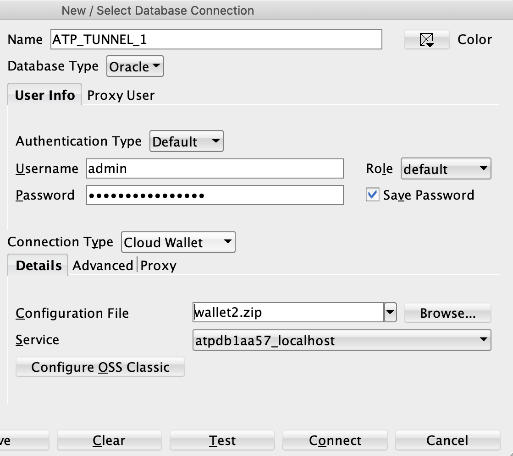

# E-commerce Web Application

This is a E-Commerce web application for Cat Products where customers can buy, view, sign up and login to purchase these products through the online web application


## Requirements


For development, you will only need 

1. [Maven](http://maven.apache.org/install.html)

2. Java 

3. Any development environment of your choice

4. Stripe API credentials. 

5. OCI ATP credentials installed on your environement.


### Stripe

Folow the steps below to get the public and private API keys from Stripe:

1. Create stripe [account](https://dashboard.stripe.com/test/dashboard)  

2. Private and public API keys


## Getting started with OCI CAAS ECOMMERCE

Clone the repository from Github:
```
$ git clone https://github.com/oracle-quickstart/oci-caas-pci-ecommerce.git

$ cd oci-caas-ecommerce

```

## Database setup


Download [SQLDeveloper](https://www.oracle.com/tools/downloads/sqldev-downloads.html)


### Initial Setup

Before you can run the OCI CAAS ECOMMERCE app you'll need spin up the oracle ATP database. To do this use the oci-caas-client and the oci-caas-terraform scripts. This will automatically provision the database.


To view the database password, go to the directory where you ran the oci-caas-client and run the 

following:

```

​$ terraform show

```

The database username is <b>admin</b> and password is output in the terminal


## Setting up the SSH tunnel


In the OCI console, navigate to the ATP database that you created and download the Wallet


Once you downloaded the Wallet, unzip the folder and update tnsnames.ora to add the following new entry for SSH tunnel connection


```

atpdb12d92_tunnel = (description= (retry_count=20)(retry_delay=3)(address=(protocol=tcps)(port=1522)(host=localhost))(connect_data=(service_name=f4dxon4zoel2z2z_atpdb12d92_medium.atp.oraclecloud.com))(security=(ssl_server_cert_dn="CN=adwc.uscom-east-1.oraclecloud.com,OU=Oracle BMCS US,O=Oracle Corporation,L=Redwood City,ST=California,C=US")))

```


Note that the port and host are updated to connect to your SSH tunnel. The entry is named {databasename}_connectionname. Adding this entry allows for connections to the database while using an ssh tunnel. It must be running to connect.

To create and run the ssh tunnel use the following command:

```

$ ssh -L 127.0.0.1:1522:{db_private_ip}:1522 opc@{bastion_public_ip}

```


## Setting up the database schema


Follwing are steps to set up the database schema:


1. Open the SQLDeveloper, and create a new connection and input the connection name, admin username, and password. 


2. For connection type, enter cloud wallet and select the downloaded cloud wallet





3. After the connection is successfully created, open the dump.sql from src/main/resources/db/


4. Change line 4 to a secure password and take note of it as ECOM user password. Note you are doing this to change the default password to a strong and a secure password.


```

​    CREATE USER ECOM IDENTIFIED BY password;

```


5. Finally run the entire schema. Note it only adds item and category data, there are no users, orders, or shopping carts.


## Running the application Locally


Once the oci-caas-ecommerce repository is cloned, open it with any development environment and update the credentials in .env.example. Change values that are encapsulated with <> (please delete these brackets).


```

​        # stripe

​        STRIPE_PUBLISHABLE_KEY=<pk_test_stripe_pub_key>

​        STRIPE_SECRET_KEY=<sk_test_secret_key>

​        

​        # db

​        ORACLE_DB_NAME=atpdb12d92_tunnel

​        ORACLE_DB_WALLET=</Users/user/path/to/wallet>

​        ORACLE_DB_USER=ECOM

​        ORACLE_DB_PASS=<'schema_pass'>

```


Once that is done copy or rename this .env.example file to .env. 

Note here the path to the wallet is the unzipped wallet with the tunnel entry


Next you need to setup the ssh tunnel for database connection


To run the application locally for development use

```
​$ source run.sh
```