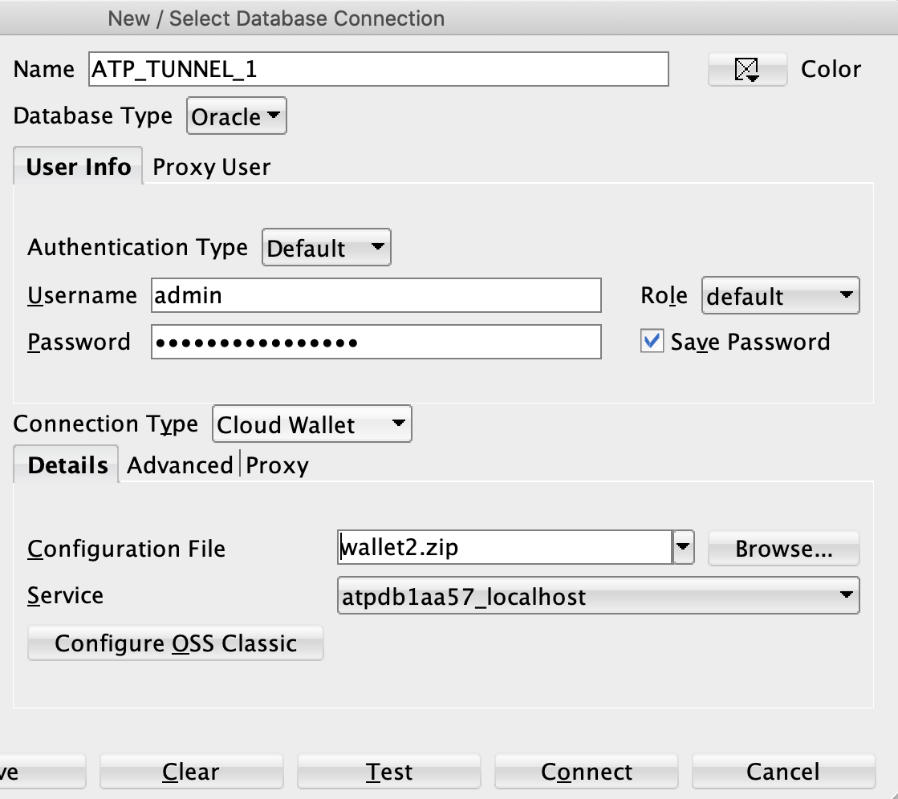

# E-commerce Web Application

This is a E-Commerce web application for Cat Products where customers can buy, view, sign up and login to purchase these products through the online web application

## Pre-requisites

For development, you will only need 

1. [Maven](http://maven.apache.org/install.html)

2. Java SE 11 (or newer)

3. [SQLDeveloper](https://www.oracle.com/tools/downloads/sqldev-downloads.html)

4. Any development environment of your choice (e.g IntelliJ)

5. Stripe API credentials. 

6. OCI ATP credentials installed on your environement.

### Stripe API keys

Folow the steps below to get the public and private API keys from Stripe:

1. Create stripe [account](https://dashboard.stripe.com/test/dashboard)  

2. Get private and public API keys

## Getting started with OCI CAAS ECOMMERCE

### Project Code

Clone the repository from Github:

```
git clone https://github.com/oracle-quickstart/oci-caas-pci-ecommerce.git

cd oci-caas-pci-ecommerce
```

### Database setup

Before you can run the OCI CAAS ECOMMERCE app you'll need spin up the oracle ATP database. To do this use the [oci-caas-client](https://github.com/oracle-quickstart/oci-caas-pci/tree/main/examples) and the [oci-caas-pci](https://github.com/oracle-quickstart/oci-caas-pci) scripts. This will automatically provision the ATP database.

To view the database password, go to the directory where you ran the oci-caas-client and run the following:

```
terraform show
```

The database username is <b>admin</b> and password is output in the terminal

### Downloading Cloud Wallet
Steps to download the cloud wallet from the console:
1. In the OCI console, navigate to the ATP database that you created
2. Click DB Connection.
3. On the Database Connection page select the Wallet Type as Instance Wallet
4. Click Download Wallet.

Note: By default the filename is: Wallet_databasename.zip. You can save this file as any filename you want.

### Setting up the SSH tunnel

Once you downloaded the Wallet, unzip the folder. 

```
unzip wallet_name.zip
```

Update <b>tnsnames.ora</b> by copying any line in the file, then:
* Set host to be equal to localhost.
* Change the name to {wallet_name}_tunnel.
* Paste this new line into tnsnames.ora
* This will enable to you connect to the SSH tunnel.

The new line should look similar to the line below:

```

atpdb12d92_tunnel = (description= (retry_count=20)(retry_delay=3)(address=(protocol=tcps)(port=1522)(host=localhost))(connect_data=(service_name=f4dxon4zoel2z2z_atpdb12d92_medium.atp.oraclecloud.com))(security=(ssl_server_cert_dn="CN=adwc.uscom-east-1.oraclecloud.com,OU=Oracle BMCS US,O=Oracle Corporation,L=Redwood City,ST=California,C=US")))

```

Note that the port and host are updated to connect to your SSH tunnel. The entry is named {databasename}_connectionname. Adding this entry allows for connections to the database while using an SSH tunnel. It must be running to connect.

Once you have made the changes to tsnames.ora file, zip the folder back up and save it.
Use the following command from within the folder to overwrite the old zip file with a new one that contains the updated tnsnames.ora file:

```
zip -r output_wallet_name.zip .
```

To create and run the ssh tunnel use the following command:

```
ssh -L 127.0.0.1:1522:{db_private_ip}:1522 opc@{bastion_public_ip}
```

### Setting up the database schema

Following are steps to set up the database schema:

1. Open the SQLDeveloper, and create a new connection and input the connection name, admin username, and password. 

2. For connection type, enter cloud wallet and select the cloud wallet you modified and saved in the steps above.



3. After the connection is successfully created, open the <b>dump.sql</b> from src/main/resources/db/

4. Change line 4 to a secure password and take note of it as ECOM user password. Note you are doing this to change the default password to a strong and a secure password. Note change this password to the one you stored as a secret in the vault.

```
CREATE USER ECOM IDENTIFIED BY "password";
```

5. Finally run the entire schema. Note it only adds item and category data, there are no users, orders, or shopping carts.

### Running the application Locally

Once the oci-caas-ecommerce repository is cloned, open it with any development environment and update the credentials in <b>.env.example</b>. Change values that are encapsulated with <> (Please delete these brackets).

```

# stripe
STRIPE_PUBLISHABLE_KEY=<pk_test_stripe_pub_key>
STRIPE_SECRET_KEY=<sk_test_secret_key>

# db
ORACLE_DB_NAME=atpdb12d92_tunnel
ORACLE_DB_WALLET=</Users/user/path/to/wallet>
ORACLE_DB_USER=ECOM
ORACLE_DB_PASS=<'schema_pass'>

```

* Once that is done copy or rename this .env.example file to .env 

* Note here the path to the wallet is the unzipped wallet with the tunnel entry.

* Next you need to setup the ssh tunnel for database connection

To run the application locally for development use go in the e-commerce directory and run this command:

```
source run.sh
```

View the application on http://localhost:8080/

## Usage
Here is a demo of the application in action.


## Testing and Validation
### Database
Run the following commands in SQLDeveloper to ensure the database is working properly:

```
SELECT * FROM ECOM.ITEM;
```
This should show a table populated with list of items.

```
SELECT * FROM ECOM.CATEGORY
```
This should show a table populated with category of items.

### Products
1. Ensure that all products and images are displayed in the homepage.

### Register/Login
1. Ensure that you are able to register for an account.
1. After you've created an account, ensure that you are able to login.

### Checkout
1. Add some items to your cart. Then go to checkout.
1. Ensure that you are able to fill out personal and payment information fields.
1. After you've filled out the fields, submit your information.
1. You should be redirected to a confirmation page.

## How to Contribute
Interested in contributing?  See our contribution [guidelines](CONTRIBUTE.md) for details.

## License
This repository and its contents are licensed under [UPL 1.0](https://opensource.org/licenses/UPL).